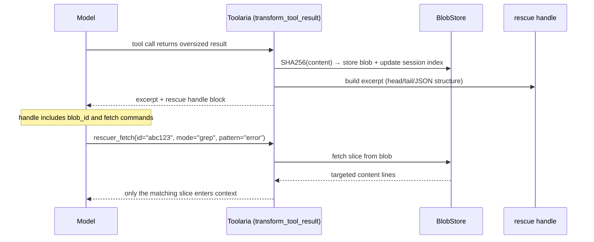

# Toolaria — Rescue oversized tool results before they flood context

Toolaria intercepts oversized tool outputs, stores them in a SHA256-addressed
blob store, and returns a compact excerpt + rescue handle. The model can then
call `rescuer_fetch` to retrieve specific slices (range, grep, stat, or full).

---

## 60-second Quickstart

```bash
# Clone into Hermes plugins directory
git clone https://github.com/Sahil-SS9/hermes-toolaria.git ~/.hermes/plugins/toolaria

# Enable in ~/.hermes/config.yaml:
plugins:
  enabled:
    - toolaria

# Restart gateway (or hermes plugin reload)
hermes plugin reload
```

That's it. Any oversized web extract, search, or browser result will now
return a compact excerpt with a rescue handle instead of flooding your context.

Check the status:

```
/rescuer
```

---

## How it works



---

## Configuration

All keys in `config.yaml` with defaults:

| Key | Default | Description |
|---|---|---|
| `max_result_chars` | `8000` | Minimum result size to trigger rescue |
| `store_path` | `~/.hermes/toolaria` | Blob and session index directory |
| `ttl_hours` | `72` | Auto-sweep blobs older than this |
| `max_store_mb` | `500` | Max total store size before oldest blobs are evicted |
| `head_lines` | `40` | Lines in excerpt head |
| `tail_lines` | `15` | Lines in excerpt tail |
| `json_head_items` | `5` | JSON array/object items at head |
| `json_tail_items` | `2` | JSON items at tail |
| `grep_timeout_ms` | `500` | Wall-clock timeout per grep |
| `grep_max_pattern_len` | `80` | Max regex pattern length |
| `refuse_full_fetch` | `true` | Block full-content retrieval for rescued blobs > threshold |
| `exclude_tools` | `[]` | Additional tools never intercepted (hardcoded defaults always apply) |

---

## What gets rescued

Only MCP server tool results and specific built-in tools:

- `web_extract`, `web_search`
- `browser_navigate`, `browser_snapshot`, `browser_console`, `browser_get_images`

Terminal output and file reads are already truncated by the agent before any
hook fires. Tools like `delegate_task`, `session_search`, `cronjob`, and
memory tools are explicitly excluded and never intercepted.

---

## Commands

| Command | Description |
|---|---|
| `/rescuer` | Show status: blob count, total size, sessions tracked |

---

## Tool: `rescuer_fetch`

The model-facing tool to retrieve slices of a rescued result.

| Mode | Required params | Description |
|---|---|---|
| `stat` | `id` | Show blob metadata (size, tool, timestamp) |
| `range` | `id`, `start`, `count` | Lines `start` to `start+count` |
| `grep` | `id`, `pattern` | Regex match within blob |
| `full` | `id` | Full content (refused by default — change config to allow) |

## Limitations

- Terminal stdout and file-read outputs are truncated before this hook fires
  (by `tool_output_limits`). Toolaria only rescues outputs from MCP/web tools
  that bypass the standard truncation.
- Blobs are evicted after TTL (default 72h) or when the store exceeds `max_store_mb`.
- The `session_id` binding uses the Hermes dispatch-layer forwarding when
  available; on vanilla Hermes (without the dispatch patch), session indexing
  falls back to the last-seen session.

## License

MIT — see `LICENSE`.
