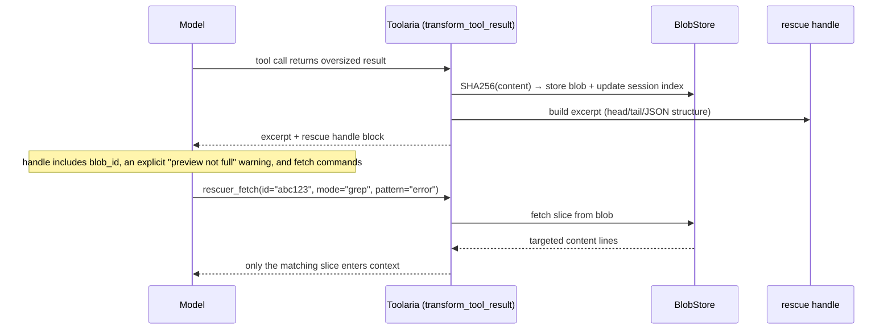

# Toolaria: rescue oversized tool results before they flood context

Toolaria is the spill-to-disk pattern, packaged as a single-purpose, zero-config
Hermes Agent plugin. When an MCP or web tool returns a result too large for the
context window, Toolaria stores the full output in a SHA256-addressed blob store
and hands the model a compact excerpt plus a fetch handle. The model retrieves
only the slices it needs via `rescuer_fetch`.

It does one thing, it is on by default, and it composes with whatever context
engine you run.

Beyond grep, a rescued blob becomes an **addressable, searchable scratch space**:

- **`outline`** gives the model a structural map (JSON schema with numeric
  column stats, HTML heading hierarchy, log error clusters) so it navigates by
  structure instead of guessing search terms.
- **`search`** runs semantic (or dep-free lexical) retrieval over the blob:
  ask in plain language, get the most relevant chunks with line numbers.
- **Pass-by-reference** lets the model hand a whole result to another tool
  without reading it: write `tla:<id>` as a downstream tool's argument and
  Toolaria expands it to the full content before that tool runs, so a 200k
  result flows tool to tool and never re-enters the context window.

---

## 60-second Quickstart

```bash
# Clone into Hermes plugins directory
git clone https://github.com/Sahil-SS9/Toolaria.git ~/.hermes/plugins/toolaria

# Install dependencies (regex gives grep a safe mid-search timeout)
pip install -r ~/.hermes/plugins/toolaria/requirements.txt

# Enable in ~/.hermes/config.yaml:
plugins:
  enabled:
    - toolaria

# Restart gateway (or hermes plugin reload)
hermes plugin reload
```

Any oversized web extract, search, or MCP result now returns a compact excerpt
with a fetch handle instead of flooding context. Check status with `/rescuer`.

---

## Prior art

Spill-to-disk is a well-established pattern, not a Toolaria invention. Toolaria's
contribution is packaging, not the idea.

- **Claude Code** persists oversized tool results to disk and replaces them with
  a short preview; the model then reads the spilled file with offset/limit and
  grep. Toolaria's `range`/`grep`/`stat`/`full` modes mirror this.
- **OpenAI Codex** issue [#14206](https://github.com/openai/codex/issues/14206)
  specifies the same contract: spill the payload, return a reference plus
  preview, support full read, ranged read, and grep/search.
- **MCP ResourceLink** ([2025-06-18 spec](https://modelcontextprotocol.io/specification/2025-06-18/server/tools))
  lets a tool return a URI handle instead of inline content.
- **Context-offloading** as a named pattern: Anthropic's
  [context engineering](https://www.anthropic.com/engineering/effective-context-engineering-for-ai-agents)
  post, LangChain's
  [filesystems for context](https://www.langchain.com/blog/how-agents-can-use-filesystems-for-context-engineering),
  and the Manus "compression must be restorable" write-up.
- **[hermes-lcm](https://github.com/stephenschoettler/hermes-lcm)** is the
  closest in-ecosystem work. It is a full context-engine replacement (message
  store, summary DAG, cross-session search) where large-output externalisation
  is one opt-in knob among many, off by default, with a metadata-only
  placeholder. Toolaria is the opposite shape: a single-purpose interceptor,
  on by default, with the preview inline, no engine swap. They compose; you can
  run Toolaria alongside lcm or alongside Hermes core.

Toolaria positions against Hermes core's default behaviour (MCP/web results
bypass the standard truncation), not against lcm.

---

## How it works



The handle is deliberately explicit that the inline text is a preview, not the
full output, because the documented failure mode of this pattern is a model
treating the preview as complete.

---

## Configuration

All keys in `config.yaml` with defaults:

| Key | Default | Description |
|---|---|---|
| `max_result_chars` | `12000` | Minimum result size to trigger rescue |
| `fetch_max_chars` | `4000` | Cap on `range`/`grep` response size |
| `full_fetch_max_chars` | `50000` | `full` mode refused above this when `refuse_full_fetch` |
| `excerpt_max_chars` | `8000` | Cap on short-content excerpts |
| `store_path` | `~/.hermes/toolaria` | Blob and session index directory |
| `ttl_hours` | `72` | Auto-sweep blobs older than this |
| `tombstone_ttl_hours` | `720` | Keep swept-blob guidance this long |
| `max_store_mb` | `500` | Max total store size before oldest blobs are evicted |
| `head_lines` | `40` | Lines in excerpt head |
| `tail_lines` | `15` | Lines in excerpt tail |
| `json_head_items` | `5` | JSON array/object items at head |
| `json_tail_items` | `2` | JSON items at tail |
| `grep_timeout_ms` | `500` | Per-search timeout (needs the `regex` package) |
| `grep_max_pattern_len` | `80` | Max regex pattern length |
| `grep_max_line_len` | `2000` | Per-line slice searched by grep |
| `refuse_full_fetch` | `true` | Refuse `full` over `full_fetch_max_chars` |
| `exclude_tools` | `[]` | Additional tools never intercepted (hardcoded defaults always apply) |
| `search_chunk_chars` | `1200` | Target size of each searchable chunk |
| `search_chunk_overlap_lines` | `2` | Lines shared between adjacent chunks |
| `search_max_chunks` | `400` | Cap on chunks indexed per blob |
| `search_top_k` | `5` | Hits returned per search |
| `search_snippet_chars` | `400` | Characters shown per hit |
| `embedding_model` | `all-MiniLM-L6-v2` | Used when `sentence-transformers` is installed |
| `passref_enabled` | `true` | Enable `tla:<id>` pass-by-reference expansion |
| `passref_max_chars` | `500000` | Cap on content expanded per token |
| `passref_total_max_chars` | `2000000` | Cap on total expansion per tool call |
| `passref_allowed_tools` | `[]` | Strict allowlist; empty means all but exec/exfil sinks |

---

## What gets rescued

Only MCP server tool results and specific built-in tools:

- `web_extract`, `web_search`
- `browser_navigate`, `browser_snapshot`, `browser_console`, `browser_get_images`

Terminal output and file reads are already truncated by the agent before any
hook fires. Tools like `delegate_task`, `session_search`, `cronjob`, and
memory tools are explicitly excluded and never intercepted.

---

## Commands

| Command | Description |
|---|---|
| `/rescuer` | Show status: blob count, total size, sessions tracked |

## Tool: `rescuer_fetch`

The model-facing tool to retrieve slices of a rescued result.

| Mode | Required params | Description |
|---|---|---|
| `outline` | `id` | Structural map: JSON schema with numeric stats, HTML headings, log error clusters |
| `search` | `id`, `query` | Semantic (or lexical) retrieval; top chunks with line numbers |
| `stat` | `id` | Blob metadata (size, tool, timestamp) |
| `range` | `id`, `start`, `count` | Lines `start` to `start+count`; the response echoes the line range and total |
| `grep` | `id`, `pattern` | Regex match within the blob, with line numbers |
| `full` | `id` | Full content (refused over `full_fetch_max_chars` by default) |

If a blob has been swept after its retention window, `rescuer_fetch` returns a
short message naming the source tool and advising the model to re-run it, rather
than a bare error.

## Pass-by-reference

A rescued result can be handed to another tool without the model reading it.
The rescue handle tells the model: to feed the whole result into a downstream
tool, pass `tla:<id>` as that tool's argument. A `tool_request` middleware
expands the token into the blob's full content before the tool executes, so the
payload flows tool to tool and never re-enters the context window.

Because the expanded content bypasses the context (and therefore any review of
model-emitted args), expansion is **denied by default for exec and exfil sinks**
(shell, exec, file-write, http-post, and similar). For security-sensitive
setups, set `passref_allowed_tools` to a strict allowlist. Per-token and
per-call size caps bound how much content one tool call can pull in.

---

## Limitations

- **Round-trip blindness, mostly addressed.** The model only sees the excerpt
  inline, so anything the excerpt heuristics drop is invisible unless it fetches
  it. The classic version of this failure, the model being unable to pass full
  content to another tool, is what pass-by-reference solves. The residue is that
  the excerpt itself is still a preview; the handle says so explicitly, and
  `outline`/`search` give the model better ways to find what it needs.
- **Search needs `sentence-transformers` for semantics.** Without it, `search`
  falls back to BM25 lexical ranking (dep-free, still useful). The embedding
  model downloads lazily on first semantic search. `numpy` is used for the
  vector maths when present, with a pure-Python fallback otherwise.
- **Pass-by-reference lands silently.** Expanded content reaches a tool without
  appearing in context, so it also bypasses any human or filter inspecting
  model-emitted args. Exec/exfil sinks are denied by default and a strict
  allowlist is available. Expansion is session-scoped when the host forwards a
  `session_id`: a token for a blob the calling session does not reference is
  refused, so cross-session expansion of a guessed id is no longer served. When
  no `session_id` is forwarded (vanilla Hermes), expansion falls back to the
  global content-addressed read so single-session setups still work.
- **Store cap is approximate.** `max_store_mb` counts blob bytes; per-blob
  sidecars (outline, chunks, vectors) add to on-disk size and are swept with
  their blob, but are not counted toward the cap.
- **Swept content is gone.** After `ttl_hours` (or size eviction) the blob file
  is deleted. A later fetch returns re-run guidance, not the content. Handles
  embedded in old compaction summaries therefore degrade gracefully rather than
  failing silently.
- **Grep needs `regex`.** Arbitrary user regex against blob content is a ReDoS
  hazard that no static guard fully closes. With the `regex` package (in
  `requirements.txt`) every pattern runs under a mid-search timeout. Without it,
  grep falls back to literal substring search and refuses metacharacter patterns.
- **Single process per store.** The in-memory lock serialises threads in one
  gateway process. Pointing two gateway processes at the same `store_path` is not
  supported.
- **Fetch is a capability model.** Any caller that knows a 12-hex blob id can
  fetch it; ids are content-derived and only revealed in the rescuing session's
  handle. Swept-blob guidance is scoped to the owning session.

## License

MIT, see `LICENSE`.
