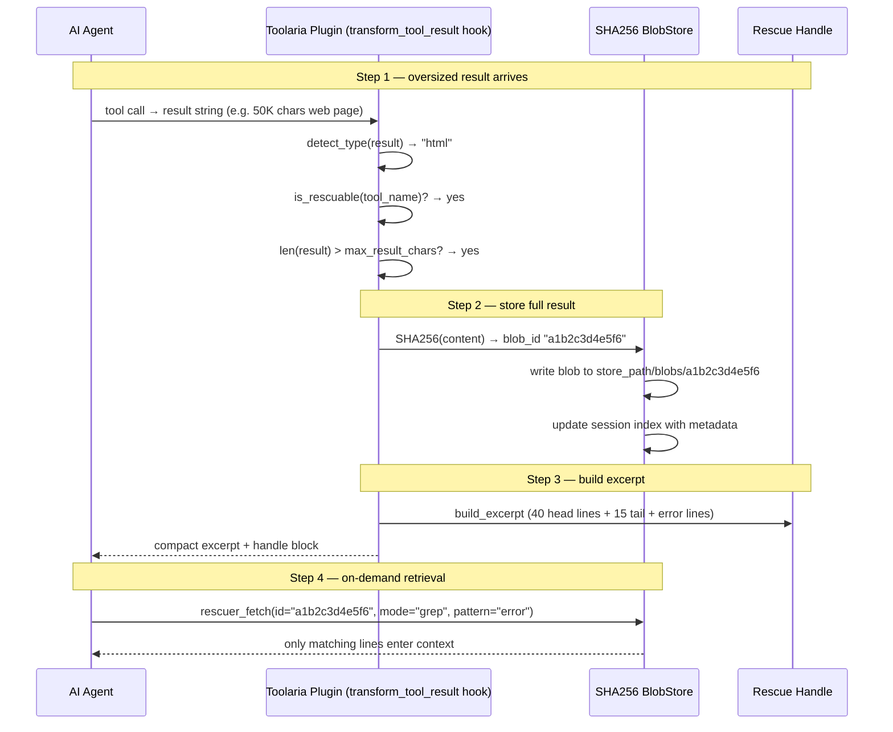

# Toolaria — Architecture

## One agent turn with oversized tool output

### Sequence diagram



### Data flow

```
Tool output (50K chars)
        │
        ▼
  transform_tool_result hook
        │
        ├── Is rescuable? ──No──► return None (passthrough)
        │
       Yes
        │
        ├── In unconditional excludes? ──Yes──► return None
        │
        No
        │
        ├── In config exclude_tools? ──Yes──► return None
        │
        No
        │
        ├── len(result) > threshold? ──No──► return None
        │
       Yes
        │
        ▼
  _rescue()
        │
        ├── blobstore.put(content, tool_name) → blob_id
        ├── detect_type(content) → (kind, meta)
        └── build_excerpt(content, kind, cfg) → compact excerpt
        │
        ▼
  Return: excerpt + handle block with fetch instructions
        │
        ▼
  Model sees rescue handle, calls rescuer_fetch(id, mode, ...)
        │
        ▼
  BlobStore.fetch(blob_id, mode, ...) → targeted content slice
```

### Storage layout

```
store_path (default ~/.hermes/toolaria/)
├── blobs/
│   ├── a1b2c3d4e5f6       # raw blob (12 hex chars = first 12 of SHA256)
│   └── f6e5d4c3b2a1       # ... more blobs
└── sessions/
    ├── session-abc123.json # per-session index (blob ids + metadata)
    └── session-def456.json
```

### Key guarantees

1. **Atomic index writes** — `tempfile.mkstemp` + `os.replace` prevents
   partial JSON reads from concurrent session threads.
2. **Cross-session safety** — Blobs are evicted only when NO session index
   still references them. A blob shared across sessions survives longer.
3. **Grep safety** — 500ms wall-clock timeout, 80-char pattern cap, nested
   quantifier rejection. All checks are code-enforced, not model-prompted.
4. **Fail-open safe** — `_UNCONDITIONAL_EXCLUDES` frozenset is checked
   before config, so tools like `delegate_task` and `session_search` can
   never be intercepted even if registry import breaks.

### The fail-open rationale

`_is_rescuable()` returns `True` when the registry import fails. This is
intentional: failing safely means rescuing a tool that shouldn't be rescued
(one extra small handle in context) vs failing dangerously by flooding ~50K
chars into context. The unconditional excludes list backs this up — critical
tools can never be intercepted regardless of what `_is_rescuable` returns.
